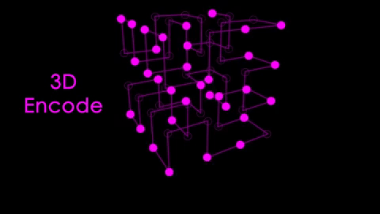

# Spatial Codec
Modified: 2021-05

<p align="center">
  
</p>

## Navigation
  1. [About](#about)
  2. [Quickstart](#quickstart)
  3. [Dev](#dev)
  4. [License](#license)

## About
Spatial codec is a spatial encoding and decoding algorithm developed for mapping a bytes to a 3D matrix at a target voxel resolution. The algorithm maps according to [Hilbert's Space Filling Curve](https://en.wikipedia.org/wiki/Hilbert_curve) which preserves the relative localization of bits in 3D independant of the matrix dimension which is a convienient property for error correction and scalable network policies.

## Quickstart
Install python dependancies
```bash
python3 -m pip install -r requirments.txt
...
```
Run the algorithm for a specified resolution `-r` / `--resolution` and dimension `-d` / `--dimension` (2 or 3)
```bash
python3 -m sc -r 1024 -d 2
```

## Dev
Setup on M1 macs requires some additional configuration. I have automated the installation:
```bash
./scripts/m1-setup.sh
```

## License
BSD 2-Clause License available [here](LICENSE)
