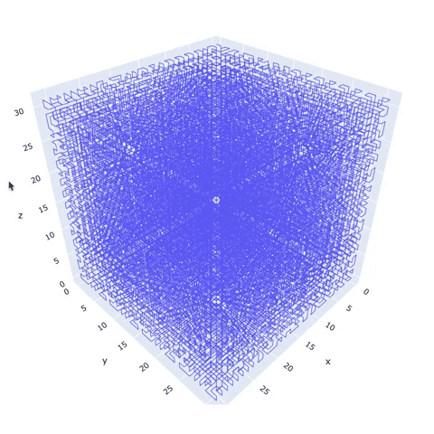

# Spatial Codec™

1. [ About ](#about)
2. [ Version ](#version)
3. [ Setup ](#setup)
4. [ Run ](#run)
5. [ License ](#lic)


<a name="about"></a>

## 1. About
<p align="center">
  
</p>

This script is a visual demonstration of a specialized spatial encoding and decoding algorithm developed for mapping a 1D bitarray to a 3D matrix with a specified voxel (3D pixel) resolution. The encoder takes a 1D bitarray and translates the bit pattern to an equivalent spatial map using a 3D matrix with specified resolution.

The spatial encoder maps according to Hilbert's space filling curve (https://en.wikipedia.org/wiki/Hilbert_curve) which preserves localized bits in 1D to geometry in 3D independant of the matrix dimension. The encoder generates a `Frame` object which comprises of a 3D matrix with bits mapped according to Hilbert's space filling curve. The spatial decoder takes a `Frame` object and matrix element multiplication to find a reduced index matrix in order to reconstruct the 1D `bitarray` mapping.

HSFC mapping allows for consistent network packing/unpacking protocols independent of the cube dimensions. Furthermore it ensures that if a localized region of the 3D space is obstructed or is unreadable, the corresponding bit data errors will be localized to a set of neighbouring bits along its 1D space which effectively reduces the severity of error across the whole message.


<a name="version"></a>

## 2. Version
This repository is staged: Version 2.0

### v2.0 update:
1. `Frame` and `SpatialCodec` implementation replaced `SpatialBit` list-based algorithm with 3D `numpy` matrices. Matrices allowed for linear algebra transformations which increase mapping computing efficiency for encoding and decoding.
2. Matrix-based implementation enabled a `remap` definition which rotates the hilbert curve spatial map to a specified viewing direction about its vertical axis. This enables encoding for different viewframes.
3. Docstring updates for better readability


<a name="setup"></a>

## 3. Setup
Python3 is recommended for optimum results. Install the following modules to enable plotting functionality:
```
pip install plotly
```
```
pip install pandas
```
Install the following module to enable the `bitarray` generation:
```
pip install bitarray
```
Finally for console prints and script progress tracking:
```
pip install progress
```

<a name="run"></a>

## 4. Run

The script takes in 2 input arguments for the default run: the first is the matrix dimension `dim` whose input must be a power of 2. The second argument `frames` defines the number of random 1D bitarray frames the algorithm will generate.

The following example will generate 32 frames on a 4x4x4 matrix map:
```
python spatial_codec.py 4 32
```

Alternatively the script can be run with an optional third input parameter defining a string hex code `bitarray` to be rendered. The following example will generate 1 frame mapping hexcode `0xffffffffffffffff` to a 4x4x4 matrix map:
```
python spatial_codec.py 4 1 ffffffffffffffff
```
Note that the `frames` argument will be automatically set to 1 regardless of the value passed if the `bitarray` argument is specified.

Once the script completes it will generate a `plotly` figure using your native browser. The initial frame will show a superposition of spatial maps for all generated frames. Using the slider you can view spatial maps for individual frames. The connecting lines follow the sequence in which the 1D bitarray constructs the 3D spatial map. By default mapping orientation (``SpatialCodec.orient = 0``), the MSB of the bitarray is at `(0,0,0)` with the corresponding LSB at `(0,0,dim-1)` where `dim` is the user specified matrix dimension.


<a name="lic"></a>

## 5. License

This project has no license and is only subject to the viewing and fork permissions stated in the Terms of Service https://help.github.com/en/github/site-policy/github-terms-of-service
